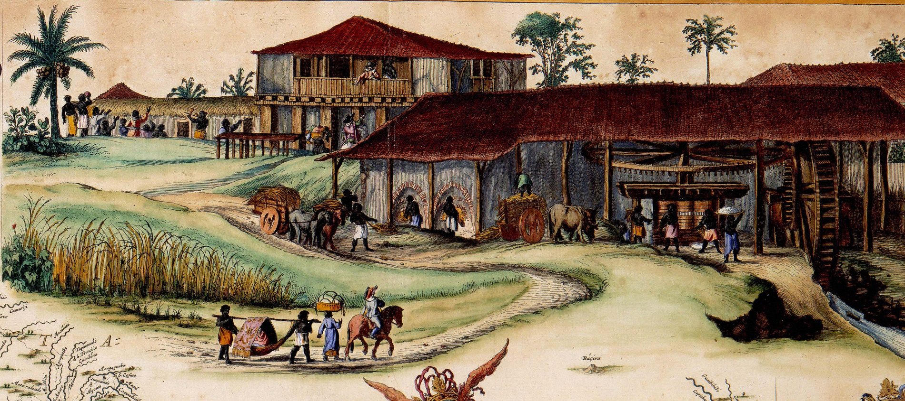
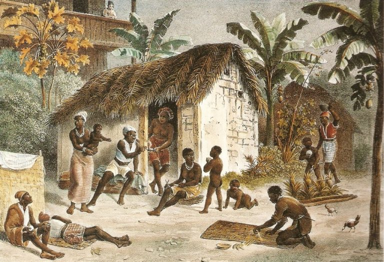
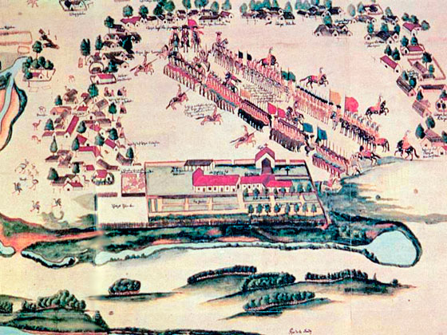

# BASE TEÓRICA - PESQUISA

A sociedade colonial brasileira estruturava-se de forma estamental, ou seja, em grupos sociais relativamente fixos, com pouca mobilidade. A posição de cada indivíduo era determinada por fatores como origem étnica, riqueza monetária, posse de terras, função religiosa ou militar, além da condição jurídica de livre ou escravizado. Embora inspirada no modelo europeu, essa estrutura foi profundamente transformada pela realidade local: a presença indígena, a escravidão africana, a miscigenação e a economia agrária moldaram uma organização própria e singular.

No topo da hierarquia encontrava-se a elite colonial, composta por senhores de terra e engenho. Esses grandes proprietários controlavam a produção açucareira e detinham poder econômico, político e religioso. Viviam na casa-grande, usufruindo de educação, cultura europeia e influência sobre as câmaras municipais. Também participavam de irmandades religiosas, financiavam igrejas e exerciam forte domínio sobre a vida local.

O clero ocupava posição estratégica, já que a Igreja Católica tinha papel central no mundo colonial. Padres, frades e bispos eram responsáveis pela educação, pelos registros civis - como batismos, casamentos e óbitos - e pela manutenção da moral pública. Muitas vezes, atuavam como conselheiros da elite e mediadores de conflitos, garantindo a presença da fé católica como pilar da ordem social.

Outro grupo de destaque eram os funcionários da Coroa, como governadores, ouvidores, capitães-mores e cobradores de impostos. Vindos de Portugal ou formados localmente, representavam os interesses da metrópole e asseguravam o funcionamento do pacto colonial. Sua presença reforçava a ligação entre a colônia e Lisboa, mantendo sob vigilância os negócios e a política locais.

Abaixo desses grupos, estavam os homens livres pobres, compostos por pequenos lavradores, tropeiros, artesãos, pescadores e soldados. Geralmente com pouca terra e renda, viviam em vilas e povoados. Alguns conseguiam ascender socialmente pelo comércio, pelo serviço militar ou por sua participação em irmandades, ainda que a mobilidade fosse limitada.

A condição das mulheres variava conforme o grupo social. Entre a elite, cabia a elas cuidar da casa-grande e da educação religiosa dos filhos. Entre os pobres e escravizados, exerciam múltiplas funções: trabalhavam na roça, na cozinha, como amas de leite, quituteiras, parteiras, rezadeiras ou pequenas comerciantes. Embora restritas pela ordem patriarcal, algumas conquistaram relevância no espaço comunitário.

A base da economia e da vida social repousava sobre os escravizados africanos e seus descendentes. Presentes nos engenhos, nas minas e nas casas, viviam sob regime de vigilância e punições, alojados nas senzalas. Apesar das condições adversas, preservaram tradições culturais e criaram formas de resistência, como os quilombos, as religiões afro-brasileiras e festas populares. Alguns conseguiam a alforria e integravam comunidades de libertos, compondo uma camada intermediária.

Os indígenas, por sua vez, sofreram com guerras, epidemias e a perda de territórios. Muitos foram escravizados nos primeiros tempos ou integrados a aldeamentos sob tutela jesuítica. Ainda assim, contribuíram de forma decisiva para a vida colonial, especialmente no fornecimento de saberes agrícolas, culinários e medicinais.

O cotidiano era marcado pelo patriarcalismo, que conferia ao homem a condição de chefe da família e da propriedade, e pela força da religião católica, que regulava costumes, festas e até a sexualidade. A miscigenação, embora comum, não resultava em igualdade: mestiços, como mulatos e caboclos, ocupavam posições intermediárias e marginalizadas. A mobilidade social existia, mas era rara, dependendo de fatores como a alforria, o casamento com pessoas de status superior ou a atuação em irmandades religiosas.

As fontes históricas permitem reconstruir essa organização complexa. Cartas régias e registros de câmaras municipais evidenciam a influência da elite e dos funcionários da Coroa; inventários post-mortem revelam bens, terras e famílias; e registros de batismos e casamentos indicam miscigenação e hierarquias. Além disso, cronistas como Antonil, Fernão Cardim e Jean de Léry deixaram descrições vivas do cotidiano, dos costumes e das relações sociais que definiram o Brasil colonial.

# ADAPTAÇÃO PARA O CONTEXTO DO TRABALHO

Seŕa feito, novamente, um painel expositivo. Dessa vez, no entanto, o destaque deve ser 

# ORGANIZAÇÃO DO PAINEL DE ORGANIZAÇÃO SOCIAL

## 1. Estrutura geral

O painel será divido verticalmente em 3 regiões principais:

**[ CABEÇALHO / TÍTULO / SUBTÍTULO ]**

---

**[ COLUNA ESQUERDA (GRUPOS SOCIAIS) ] | [ COLUNA DIREITA (ESPAÇOS SOCIAIS) ]**

---

**[ RODAPÉ ]**

## 2. Proporções
Topo: faixa de 15% da altura com título e subtítulo (legível).

Corpo: 75% da altura dividido em 2 colunas: Esquerda 60% - blocos grandes para os grupos sociais (elite / clero / livres pobres / escravizados / indígenas); Direita 40% - espaços sociais (casa-grande / senzala / aldeamento) com imagens e legendas.

Rodapé: 10% da altura com mini-glossário dos termos usados no texto[1] e QR Codes para site com as notas do apresentador (serve de guia para as falas)[1].

_*1 (ideia posterior aos outros documentos, pode ser adicionada conforme a necessidade)_

## 3. Fontes tipográficas
* **Título:** EB Garamond 64-80
* **Subtítulo:** Montserrat 24-30
* **Cabeçalhos de blocos:** Aptos bold 28-34
* **Texto corrido:** Space Mono 12-14

## 4. Paleta de cores:
Fundo principal: cinza-escuro (#181B1A)
Textos: off-white (#F9F9F9)

## 5. Conteúdo

### Cada bloco de grupos sociais contém:
Título; texto principal (5~7 linhas) e uma pequena citação histórica em papel envelhecido.

### Cada bloco de espaços sociais contém:
Título; imagem ilustrativa pequena com legenda.

### Topo:
- Título: A Sociedade Colonial Brasileira
- Subtítulo: Hierarquias, espaços e práticas entre o século XVI e o início do XIX.

### Corpo 1 - esquerda - blocos:
- Título: ELITE COLONIAL (Senhores de Terra e Engenho)
- Texto: A elite colonial concentrava riqueza e poder em torno dos latifúndios e dos engenhos de açúcar. Senhores de engenho controlavam a produção, o mercado e a vida política local, ocupando cargos nas câmaras e presidindo irmandades. A casa-grande simbolizava prestígio: ali se recebiam visitas, se patrocinavam festas religiosas e se formavam redes de parentesco e clientela. Apesar dos símbolos de opulência, essa posição exigia capital constante e podia ser sensível a crises de safra, epidemias e flutuações de preço.
- Citação: “Senhores que financiam igrejas e presidiam as irmandades, confirmavam assim seu lugar na comunidade.”

---

- Título: CLERO
- Texto: O clero católico era pilar institucional da colônia: administrava escolas, gastos paroquiais e os registros de batismo, casamento e óbito que organizavam a vida civil. Padres e frades também atuavam como conselheiros da elite, mediadores e agentes morais. Igrejas e confrarias funcionavam como centros sociais e culturais, onde se combinavam devoção, controle e sociabilidade comunitária.
- Citação: “A paróquia é lugar de registro, ensino e disciplina moral da vila.”

---

- Título: HOMENS LIVRES POBRES
- Texto: Compunham-se por pequenos lavradores, artesãos, tropeiros, vendedores e soldados - homens que viviam nas vilas e nas freguesias com poucos bens e muita mobilidade diária. Muitos dependiam de ofícios, de mercados locais ou de vínculos com patrões para sobreviver. A ascensão social existia, mas era rara: dela dependiam alianças, serviços militares, comércio articulado ou participação em irmandades.
- Citação: “O pequeno lavrador labuta, vende e busca socorro nas festas e confrarias da vila.”

---

- Título: ESCRAVIZADOS AFRICANOS E AFRODESCENDENTES
- Texto:  A base material da economia colonial assentou-se no trabalho escravo: campos, engenhos, trabalho doméstico e as lavras auríferas. Abrigados na senzala, submetidos a castigos e controle, os escravizados desenvolveram estratégias culturais e formas de resistência - quilombos, cultos sincréticos, festas, cantos e ofícios - que preservaram identidades e criaram redes de apoio. A alforria era possível, mas limitada: os libertos formaram uma camada social ambígua entre a servidão e a liberdade formal.
- Citação: “Negar-lhes seus folguedos é torná-los desconsolados; por isso lhes permitem festas e reis do Rosário.”

---

- Título: INDÍGENAS
- Texto: Os indígenas viveram trajetórias variadas: aldeados pelos jesuítas, cooptados como mão-de-obra, ou resistindo em fuga nas matas. Epidemias, guerras e perda de territórios reduziram populações, mas os povos nativos continuaram a contribuir com saberes agrícolas, práticas medicinais e formas culturais que se entranharam na vida colonial (alimentação, técnicas, instrumentos). Muitos mantiveramlaços com seus territórios, enquanto outros se integraram a comunidades mistas.
- Citação: “Tribos trazem roças, beiju e instrumentos; suas técnicas alimentam a colônia.”

### Corpo 2 - direita - blocos:
    - Título: CASA-GRANDE
    - Legenda: Casa-grande - planta típica de engenho (séc. XVIII).
    - Imagem: Engenho de Itamaracá (Frans Post).

    - Título: SENZALA
    - Legenda: Senzala - habitação coletiva.
    - Imagem: Habitação de negros (Johann Moritz Rugendas).

    - Título: ALDEAMENTO
    - Legenda: Aldeamento jusuítico no além-mar: espaço missionário.
    - Imagem: Aldeamento jesuítico em imagem da segunda metade do século XVIII (Crédito: Florian Paucke/Wikimedia Commons).

### Rodaé:
- Senhor de engenho: Proprietário de engenho de açúcar; central na economia e na política local.

- Alforria: Ato formal de libertar um escravizado; permitia ascensão limitada.

- Irmandade: Associação religiosa que organizava devoções, festas e apoio social; espaço de sociabilidade e influência.

- Tropeiro: Condutor de tropas de mulas; articulador de comércio regional e mobilidade.